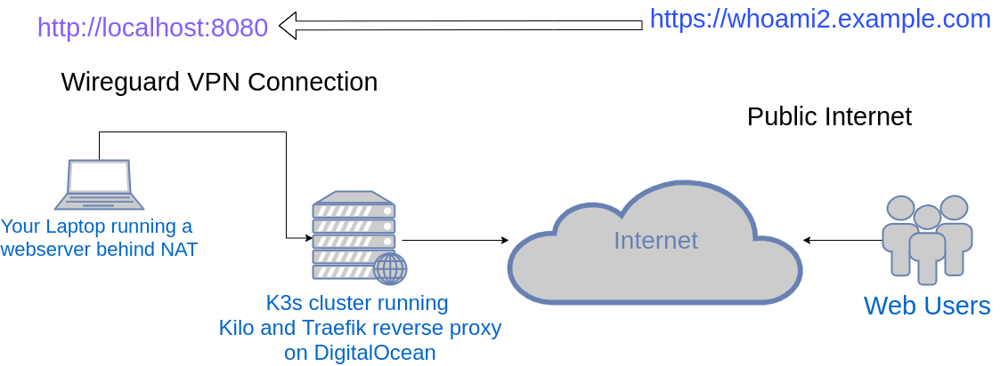

# k3s-wireguard-proxy

*warning: prototype working but left unfinished.

Publish your local running services to the internet through a
[wireguard](https://www.wireguard.com/) VPN connected to a public facing
kubernetes cluster running [Traefik](https://docs.traefik.io/).

You can use this like a self-hosted ngrok.

Due to the security concerns in running this, I have resisted the urge to
automate this with a fancy wrapper script. Instead, I invite the active reader
to follow along and understand the details outlined here. It will take about
5-10 minutes if you're already familiar with the basic concepts.

## How it works



Following this guide you will:

 * Configure and create a new single-node [k3s](https://k3s.io/) cluster on
   DigitalOcean ($5/mo droplet) utilizing
   [k3sup](https://github.com/alexellis/k3sup). Or, you can use any VPS provider
   you like, you just need to be able to ssh as root for k3sup to work. You can
   also use any existing kubernetes cluster. k3sup will automatically setup the
   key on your local workstation for remote access with kubectl.
 * Install [kilo](https://github.com/squat/kilo), which creates a wireguard
   service inside your k3s cluster network.
 * Create a wireguard network interface on your local workstation.
 * Maintain your connection (enabled on boot) through
   [systemd-networkd](https://wiki.archlinux.org/index.php/Systemd-networkd)
 * Create a simple web service running on your workstation/laptop.
 * Create a Service and IngressRoutes through
   [Traefik](https://docs.traefik.io/), which forwards from your internet domain
   to your local workstation, through the VPN, and exposing your local service
   to the internet.

## Clone this repository on your workstation/laptop

```
DIR=$HOME/git/vendor/enigmacurry/k3s-wireguard-proxy
git clone https://github.com/EnigmaCurry/k3s-wireguard-proxy.git $DIR
cd $DIR
```

## Create a single node k3s cluster on DigitalOcean

### From DigitalOcean console:

 * Create a $5 Droplet on Ubuntu 20.04(LTS) (1GB RAM)
 * Checkmark the `User data` box and then paste the following text into the user data textarea:
```
#!/bin/bash
ufw allow 22
ufw allow 80
ufw allow 443
ufw allow 6443
ufw allow 51820
ufw enable
ufw status

apt-get update -y
apt-get install -y wireguard wireguard-tools
``` 
 * Assign an SSH pubkey from your workstation/laptop. 
   * If you haven't got one yet, click `New SSH Key` and follow the on-screen
     directions.
 * For this example, set the hostname to `k3s-wireguard`.
 * Finish creating the droplet.
 * Once created, assign a floating ip address to the droplet. (optional.)
 * Create domain name(s) and DNS that points to your droplet's (floating) ip address.
 * From your workstation, ssh to the IP address, and watch the cloud-init progress complete:
```
ssh root@<IP-address> cloud-init status -w
```
 * Wait for cloud-init to report `status: done`
 
### Administer cluster from your workstation/laptop:

Install kubectl:
 * Prefer your os packages:
   * Arch: `sudo pacman -S kubectl`
   * Ubuntu and Other OS: [See docs](https://kubernetes.io/docs/tasks/tools/install-kubectl/#install-using-native-package-management)

[Install k3sup](https://github.com/alexellis/k3sup#download-k3sup-tldr)

```
curl -sLS https://get.k3sup.dev | sh
sudo install k3sup /usr/local/bin/
```

Create the cluster:
```
mkdir -p ${HOME}/.kube
k3sup install --ip <IP_ADDRESS> --k3s-extra-args '--no-deploy traefik' --local-path ${HOME}/.kube/config
```

Test access with kubectl:
```
kubectl get nodes -o wide
```

Install [kilo](https://github.com/squat/kilo):
```
kubectl annotate node k3s-wireguard kilo.squat.ai/location="digitalocean"
kubectl apply -f https://raw.githubusercontent.com/squat/kilo/master/manifests/kilo-k3s.yaml
```

## Connect local wireguard client to cluster

First, make sure you are running a firewall locally. This is in order to to deny
incoming connections by default. Enabling the default `ufw` settings will do
this for you, but you may have to [install
ufw](https://wiki.archlinux.org/index.php/Uncomplicated_Firewall) first.

After you install ufw, make sure to enable it:

```
sudo systemctl enable --now ufw
sudo ufw enable
```

The default settings will block most incoming ports, but will still allow SSH.
If you don't need SSH, run `sudo ufw deny ssh`. For any ports you need to open
generally, you could run `sudo ufw allow [PORT]`.

Create a wireguard keypair for your workstation/laptop:
```
wg genkey | tee /tmp/k3s-wireguard-key | wg pubkey > /tmp/k3s-wireguard-pubkey
```

Create the peer entry to allow your key access to the cluster:
```
cat <<EOF | kubectl apply -f -
apiVersion: kilo.squat.ai/v1alpha1
kind: Peer
metadata:
  name: ${USER}-${HOSTNAME}
spec:
  allowedIPs:
  - 10.5.0.1/32
  publicKey: $(cat /tmp/k3s-wireguard-pubkey)
  persistentKeepalive: 10
EOF
```

Install [kgctl](https://github.com/squat/kilo/blob/master/docs/kgctl.md) command line tool:
 * Install [go](https://golang.org/doc/install) and make sure `$HOME/go/bin` is
   in your `PATH` environment variable.
   * In your `$HOME/.bash_profile` (or maybe `.bashrc` depending) put: 

```
export PATH=$HOME/go/bin:$PATH
```

 * Install `kgctl`:
```
go get github.com/squat/kilo/cmd/kgctl
go install github.com/squat/kilo/cmd/kgctl
```

Get the peer configuration:
```
kgctl --kubeconfig ${HOME}/.kube/config showconf peer ${USER}-${HOSTNAME} > /tmp/k3s-wireguard.ini
```

Setup [systemd-networkd](https://wiki.archlinux.org/index.php/Systemd-networkd) on your workstation, which you may need to install first. Then make sure its enabled:

```
sudo systemctl enable --now systemd-networkd
```

Setup systemd-networkd devices:

```
cat <<EOF | sudo tee /etc/systemd/network/40-k3s-wireguard.netdev
[NetDev]
Name = wg-k3s
Kind = wireguard
Description = k3s -> kilo WireGuard VPN

[WireGuard]
PrivateKey = $(cat /tmp/k3s-wireguard-key)

$(cat /tmp/k3s-wireguard.ini | sed 's/\[Peer\]/\[WireGuardPeer\]/')
EOF
```

Setup systemd-networkd network:

```
cat <<EOF | sudo tee /etc/systemd/network/45-k3s-wireguard.network
[Match]
Name=wg-k3s

[Network]
Address = 10.5.0.1/32

$(for ip in $(grep AllowedIPs /tmp/k3s-wireguard.ini | cut -f 3- -d ' ' | tr -d ','); do
   cat <<OOF
[Route]
Destination = $ip

OOF
done)
EOF
```

Now restart systemd-networkd:

```
sudo systemctl restart systemd-networkd
```

Check to see both the interface *and* the peer are connected:

```
sudo wg
```

You should see output similar to:

```
interface: wg-k3s
  public key: XXXXXXXXXXXXXXXXXXXX
  private key: (hidden)
  listening port: 38051

peer: XXXXXXXXXXXXXXXXXXXXXXXXXXX
  endpoint: X.X.X.X:51820
  allowed ips: 10.4.0.1/32, 10.48.0.5/32, 10.42.0.0/24
  latest handshake: 55 seconds ago
  transfer: 348 B received, 596 B sent
  persistent keepalive: every 10 seconds
```

Ping the peer to test (the first ip of the allowed ips from `sudo wg`):
```
ping -c3 10.4.0.1
```

Test it works the other direction by pinging your local workstation from the k3s node:
```
ssh root@<Public_IP_Address> ping -c3 10.5.0.1
```

If it didn't work, check that the interface acquired the ip address (`10.5.0.1`):

```
ip addr show dev wg-k3s
```

Debug any systemd-networkd errors that might be in the log:

```
journalctl --unit systemd-networkd
```

Check the kilo logs:

```
kubectl logs -n kube-system -l app.kubernetes.io/name=kilo
```

## Create the traefik reverse proxy

Make sure to change to the directory where you cloned this repository

```
cd $DIR
```

Make a copy of the included `prod-template` directory and call it `prod`:

```
cp -a src/prod-template/ src/prod
```

(`src/prod` is in the `.gitignore` file, so your changes in this directory are
not stored in git. If you wish to commit them, remove this line from
`.gitignore`)

The `src/prod` directory is now your directory to make configuration changes. 

Edit `src/prod/traefik/030-traefik-daemonset-patch.yaml`:

 * Choose the Lets Encrypt CA server for staging or prod. Use the
   `acme-staging-v02` until you are finished testing, but when you want to
   install permanently, change it to `acme-v02` to use the production Lets
   Encrypt server.
 * Edit your email address for Lets Encrypt certificates

Edit `src/prod/whoami/020-whoami-ingress-route-patch.yaml`:

 * Change the domain for the whoami ingress

Now apply the configuration to the cluster:

```
kubectl apply -k src/prod/traefik
```

Open your web broweser and test that you can reach the whoami service at the
domain you chose. If using the staging Lets Encrypt server, the certificate
won't be valid, but verify that the certificate is issued by `Fake LE
Intermediate` to know if its working or not.

## Create local HTTP server to expose to the internet

For this example, we will again use
[containous/whoami](https://github.com/containous/whoami) but this time running
on your local workstation, and not inside a container. You can test with any
other HTTP server if you have one running already.

Install `whoami`:

```
go get github.com/containous/whoami
go install github.com/containous/whoami
```

Open the firewall to allow access to port `8080` only from the VPN:

```
sudo ufw allow from 10.4.0.1/32 to any port 8080
```

start the service in the background:

```
whoami -port 8080 -name local &
```

You can test it works locally by opening your browser to
[http://localhost:8080](http://localhost:8080)

Create the Service on the cluster:

```
cat <<EOF | kubectl apply -f -
apiVersion: v1
kind: Service
metadata:
  name: ${USER}-${HOSTNAME}-whoami
spec:
  ports:
    - port: 8080
---
apiVersion: v1
kind: Endpoints
metadata:
    name: ${USER}-${HOSTNAME}-whoami
subsets:
  - addresses:
      - ip: 10.5.0.1
    ports:
      - port: 8080
EOF
```

Create the ingress route to expose to the internet, change the domain
appropriately:

```
DOMAIN=whoami2.example.com

cat <<EOF | kubectl apply -f -
apiVersion: traefik.containo.us/v1alpha1
kind: IngressRoute
metadata:
  name: ${USER}-${HOSTNAME}-whoami
  namespace: default
spec:
  entryPoints:
    - websecure
  routes:
  - match: Host(\`$DOMAIN\`)
    kind: Rule
    services:
    - name: ${USER}-${HOSTNAME}-whoami
      port: 8080
  tls:
    certResolver: default
EOF
```

Now you should be able to access the public URL for the service at the domain
you chose (https://whoami2.example.com).

## Alternative software

You may also like to check out these projects which do roughly the same thing
but with different tools:

 * [inlets](https://github.com/inlets/inlets)
 * [sish](https://github.com/antoniomika/sish)
 * [ngrok](https://ngrok.com/)
